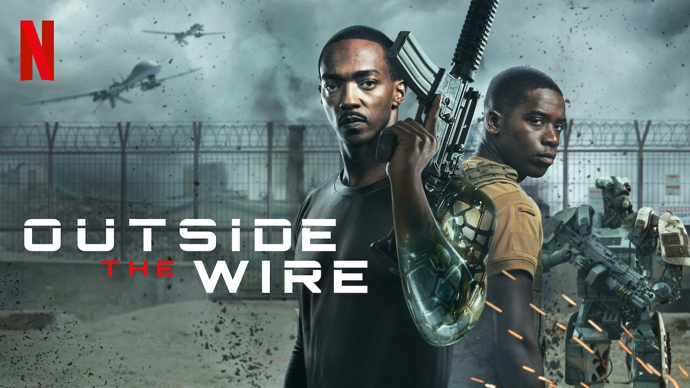

It is the year 2036. Eastern Europe is engulfed in civil war—the sort of civil war that enables filmmakers to keep the ideologies vague and the names sinister-sounding. Drone operator Lieutenant Harp  disobeys a direct order to take out a deadly truck. He saves about three dozen soldiers but two fighting men perish. There is bad feeling all around.

<!--more-->

He’s sent back to training, but he’s really on a secret mission, working with one Captain Leo (Anthony Mackie). Like Harp, he’s Black, and like Harp, he cusses a bit. Unlike Harp, he’s a cyborg—“fourth generation biotech and I’m giving you 60 seconds to deal with it.”

Leaving base, they witness some soldiers heaping abuse on a more obvious robot soldier—these dumb guys are called “Gumps,” get it?—and Leo looks on ruefully. Once back in Eastern Europe, and on the hunt for a madman named Victor Koval (what did I tell you about the names) who’s after some nuclear codes (plus ça change in semi-hacky war/espionage movies), Leo demonstrates some advantages of not being human. He operates with a kind of realpolitik—doesn’t act out of sentiment, stays focused on the immediate. Or so it seems. “I have the ability to break the rules,” he tells Hart. He likes Hart because of his drone decision by the way—says he needs someone who can “think outside the box.” Paradoxically, though, he tells Hart, “Maybe humans aren’t emotional enough, Lieutenant.”

Directed with a brisk not-quite chaos cinema style by Mikael Håfström from a script by Rowan Athale and Rob Yescombe, the movie waits a good 50 minutes before showing Leo as a real fighting machine but doesn’t take it too far. Yeah, he can kick multiple asses with haste but he doesn’t run like a Robert Patrick model Terminator or anything. (Glenn Close in “Hillbilly Elegy” would be unimpressed.) As for cerebral endowments, despite being in Eastern Europe Leo doesn’t have to be as much of a super linguist as you’d expect from a robot because in THIS Eastern Europe all but a very few speak perfect English as a default.

The fact that the two characters are black is a red herring; race doesn’t really figure here even as a metaphor. Instead, the movie’s plot and the interaction of the two characters focuses on the robot’s true mission, and the conclusions to which his autonomous robot-thought has brought him. When Leo introduces Hart to an Irish “resistance” fighter, the Lieutenant begins to suspect that, while a product of American ingenuity, Leo might have intentions very contrary to American orders. And indeed, it turns out that Leo, like Hebrew National, is set on answering to a higher authority, one with which fans of “Star Trek: The Wrath of Khan” will be quite familiar.

And so we are treated to almost every cliché in the book, complete with dialogue like “Sometimes you gotta get dirty to see the real change” and “Humans could learn to do better” and a countdown readout in big red letters at the movie’s climax. The visual effects are decent, the cast is better than decent, and that’s all, folks.
